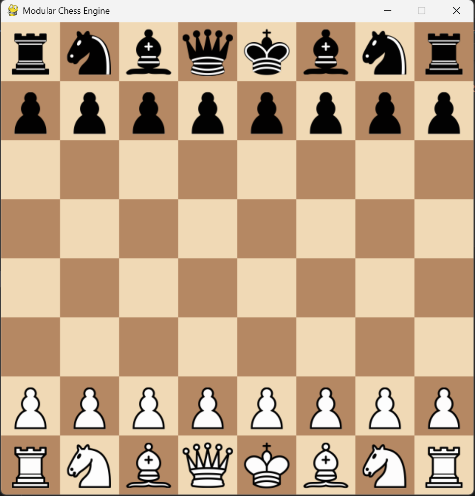
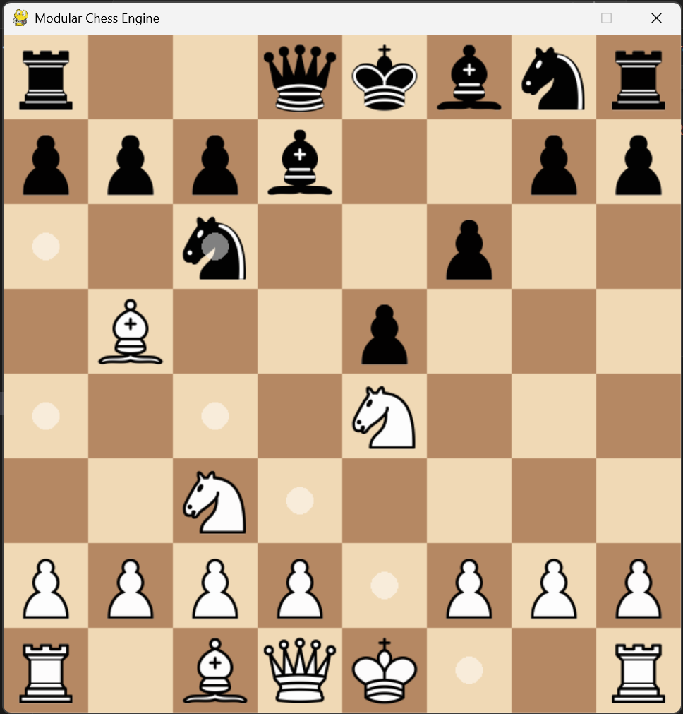

# Bezier Curve Explorer

Interactive tool for creating, editing, Bezier curves (quadratic & cubic). Designed for quick experimentation and as a visual aid for learning curve math and path design.

## Core Features

- Interactive control-point editor (add, drag, remove)
- Support for quadratic and cubic Bezier curves
- Real-time rendering and adjustable sampling/resolution
- Toggleable control polygon and curve tangents
- Lightweight, single-file entrypoint for easy integration

## Tech Stack

- Python 3.11+
- Pygame for rendering and input
- Optional: numpy (performance)

## Quick Start

### Prerequisites

- Python 3.11 or newer

### Setup & Run

Open a terminal in the project folder (example path shown):

Windows:
```bash
cd /D:/dev/projects/chess
python -m venv venv
venv\Scripts\activate
pip install -r requirements.txt
python main.py
```

Linux / macOS:
```bash
cd /D:/dev/projects/chess
python -m venv venv
source venv/bin/activate
pip install -r requirements.txt
python main.py
```

Or install minimal dependencies directly:
```bash
pip install pygame numpy
```

## Controls

- Left-click + drag: move nearest control point
- Right-click: add/remove control point
- Mouse-scroll: zoom in/out
- Delete / Backspace: clear all points
- Space: loop through info profiles

## Files

- main.py — entrypoint and UI loop
- board.py — curve math & evaluation utilities
- engine.py — game logic and AI
- ui.py — user interface and rendering
- audio.py — sound effects
- models.py — data models
- requirements.txt — pip dependencies
- README.md — this file
- assets/ — optional screenshots or example exports

## License

MIT License — see LICENSE file.

## Screenshots



